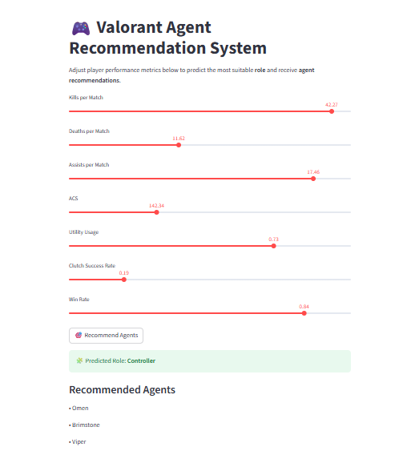

# 🎮 Valorant Playstyle Analysis & Agent Recommendation System  


**Machine Learning & Data Science Project**

---

## Project Overview

This project applies **Machine Learning** techniques to analyze **Valorant player playstyles** and build an **agent recommendation system** based on in-game behavior and performance metrics.

The goal is to move beyond raw statistics and answer two practical questions:

1. **What type of player is this?** (Playstyle discovery using clustering)  
2. **Which Valorant agents suit this player best?** (Role-based recommendation using supervised ML)

The project is designed to reflect **real-world ML decision-making**, including identifying and correcting modeling design flaws.

---

## ⚠️ Data Source & Design Choice

### Why synthetic data?

Public datasets for **ranked or normal (non-esports) Valorant matches** are not readily available due to:
- API access limitations
- Privacy restrictions
- Heavy bias toward professional esports data

To address this, I created a **synthetic but realistic dataset** based on:
- Actual Valorant gameplay mechanics
- Common performance ranges across ranks
- Role-specific behavior patterns

This approach is commonly used in industry for:
- ML prototyping
- Restricted-data environments
- Demonstrating modeling logic and reasoning

All assumptions are **explicitly documented**, and realism was prioritized over random generation.

---

## Dataset Design & Realism Enhancements

### Synthetic Player Dataset Includes:
- Player rank
- Agent and role
- Kills, deaths, assists, ACS
- Headshot percentage
- Utility usage
- Clutch success rate
- Win rate

### Modeling Real-World Extremes (Outliers)

With the help of **AI-assisted code generation**, the dataset intentionally includes **rare extreme performances**, such as:
- 40+ kill “pop-off” games
- Very low-impact Iron-rank matches
- High-ACS outliers

These extremes were added using **controlled probabilistic logic**, ensuring:
- Long-tailed distributions
- Realistic variance
- No distortion of overall patterns

This makes the dataset behave more like **real ranked gameplay**, rather than clean textbook data.

---

## Project Structure

```

valorant-ml-nlp-project/
│
├── data/
│ ├── raw/
│ │ └── player_stats.csv
│ └── processed/
│ └── player_stats_with_playstyles.csv
│
├── notebooks/
│ ├── 00_generate_synthetic_data.ipynb
│ ├── 01_playstyle_clustering.ipynb
│ └── 02_agent_recommendation.ipynb
│
├── README.md
└── requirements.txt

```

---

## 🔹 Module 1 — Synthetic Data Generation

- Designed domain-aware Valorant player features
- Modeled rank-based performance distributions
- Added **rare extreme performances** to reflect real gameplay variance
- Generated a reproducible dataset for downstream ML tasks

---

## 🔹 Module 2 — Playstyle Discovery (Unsupervised Learning)

### Methodology:
- Feature scaling
- K-Means clustering
- Elbow Method for optimal cluster selection

### Identified Playstyles:
- **Aggressive Fraggers**
- **Aim-Focused Duelists**
- **Utility & Clutch Specialists**
- **Low-Impact / Learning Players**

Clusters were validated using:
- Statistical summaries
- Behavioral visualizations

---

## 🔹 Module 3 — Agent Recommendation System (Supervised Learning)

### Initial Design Flaw

The initial approach attempted to predict **exact agents** directly (23-class classification).

**Result:**
- Poor performance due to overlapping agent behaviors
- Insufficient feature separability at agent level

### Redesign & Solution

The system was redesigned into a **two-stage recommendation pipeline**:

#### Stage 1 — Role Prediction
- Predict agent **role** (Duelist, Controller, Sentinel, Initiator)
- Logistic Regression classifier
- Achieved **~65% accuracy**, well above random baseline

#### Stage 2 — Agent Recommendation
- Recommend suitable agents **within the predicted role**
- Rule-based, explainable logic
- Improves realism and interpretability

### Example Output
Predicted Role: Sentinel
Recommended Agents: Sage, Cypher, Killjoy


---

## Model Performance Summary

- Role Classification Accuracy: **~65%**
- Duelist role showed strongest separability
- Initiator role showed overlap due to hybrid gameplay
- Results were analyzed and explained rather than blindly optimized

---

## Future Improvements & Roadmap

Planned enhancements include:

- 📊 Improve Initiator role performance through feature engineering
- 🌲 Experiment with Random Forest and XGBoost models
- 🧠 Apply NLP to Valorant patch notes for meta-shift analysis
- 🎮 Build a Streamlit web app for interactive agent recommendations

---

## Key Takeaways

This project demonstrates:
- End-to-end ML pipeline design
- Domain-aware feature engineering
- Identification and correction of modeling design flaws
- Explainable and realistic recommendation logic
- Clean, professional GitHub project structure

Rather than focusing only on accuracy, the project emphasizes **correct problem framing**, **interpretability**, and **real-world ML reasoning**.

---

## 🎮 Streamlit Demo

This project includes an interactive **Streamlit application** that allows users to input player performance metrics and receive:

- Predicted **agent role** based on playstyle and performance
- Recommended **Valorant agents** aligned with the predicted role

The Streamlit app demonstrates how the trained machine learning model can be used in a real-world, user-facing setting.



---

## ▶️ Run the Streamlit App Locally

Follow these steps to run the interactive Streamlit demo on your machine:

### 1. Clone the repository
```bash
git clone https://github.com/nihma-2002/valorant-ml-nlp-project.git
cd valorant-ml-nlp-project

### 2. Create and activate a virtual environment
```bash
python -m venv venv

# Windows
venv\Scripts\activate

# macOS / Linux
source venv/bin/activate

### 3. Install dependencies
```bash
pip install -r requirements.txt

### 4. Run the streamlit app
```bash
streamlit run app/app.py

This app will run automatically at browser : http://localhost:8501

---

## 🚀 Deployment Notes

The Streamlit application is structured to be easily deployable on platforms such as **Streamlit Community Cloud** or similar hosting services.

### Deployment Readiness
- The app loads a pre-trained machine learning model from the `models/` directory
- All dependencies are listed in `requirements.txt`
- The application follows a clear project structure suitable for deployment

### Example Deployment Workflow
1. Fork or clone this repository to your GitHub account
2. Connect the repository to Streamlit Community Cloud
3. Set the main file path as: app/app.py
4. Deploy the application

Once deployed, the app can be accessed via a public URL, allowing users to interact with the model without running the code locally.

